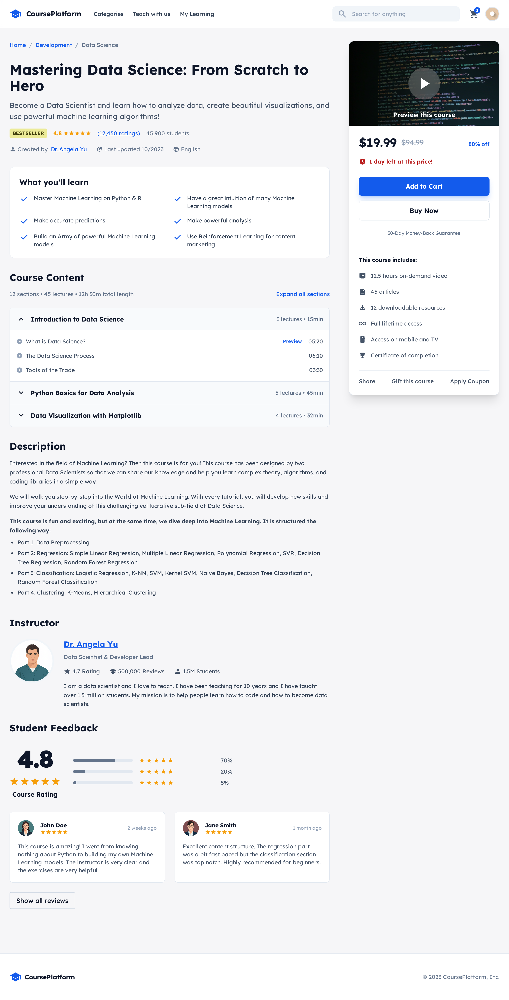
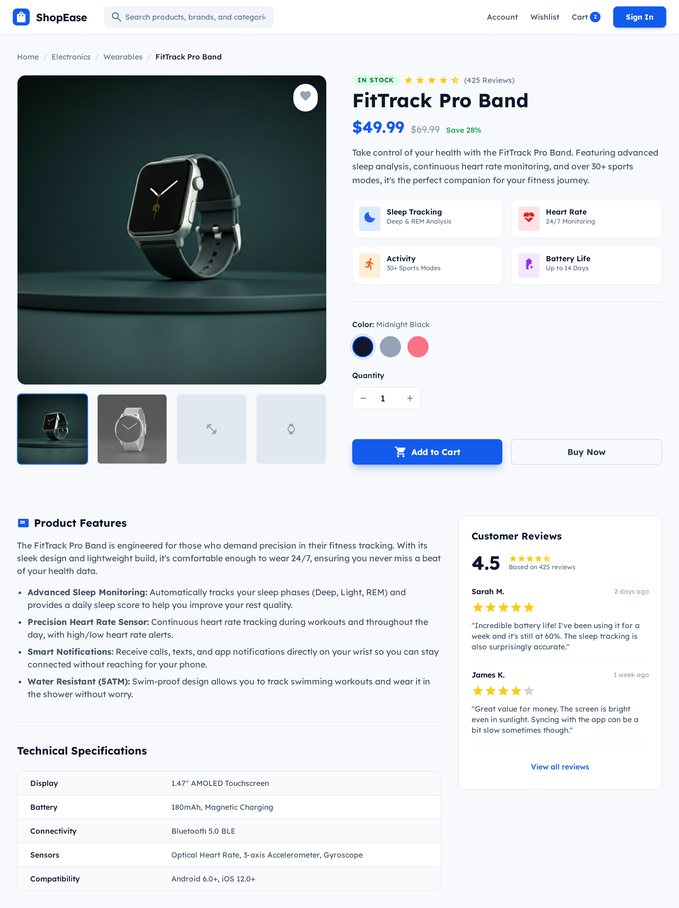
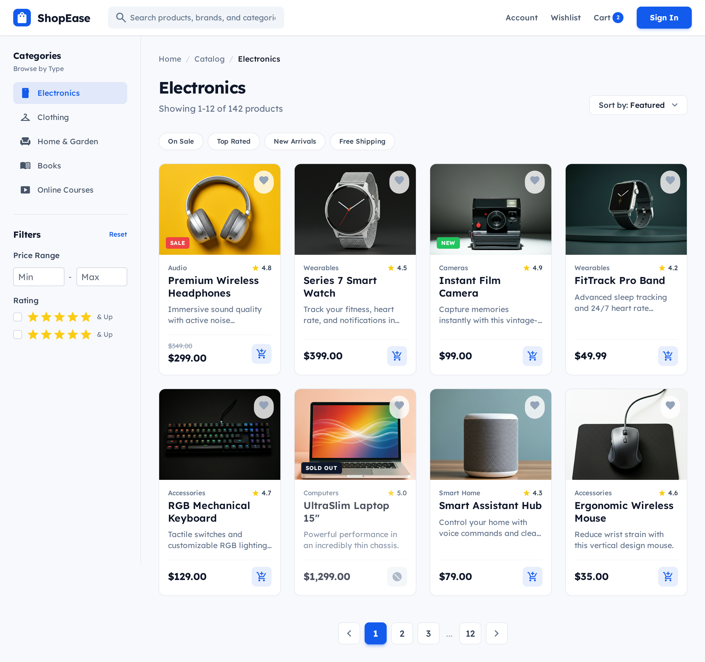
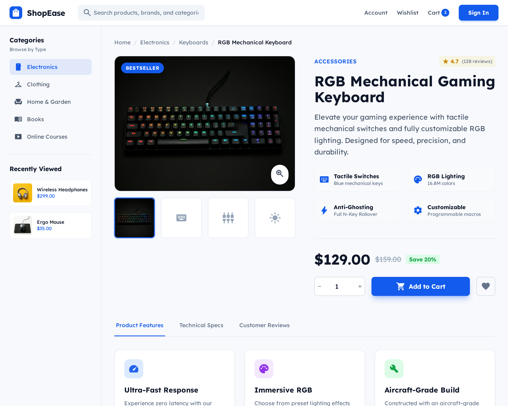
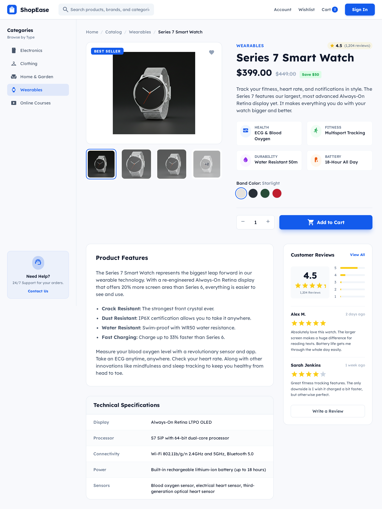
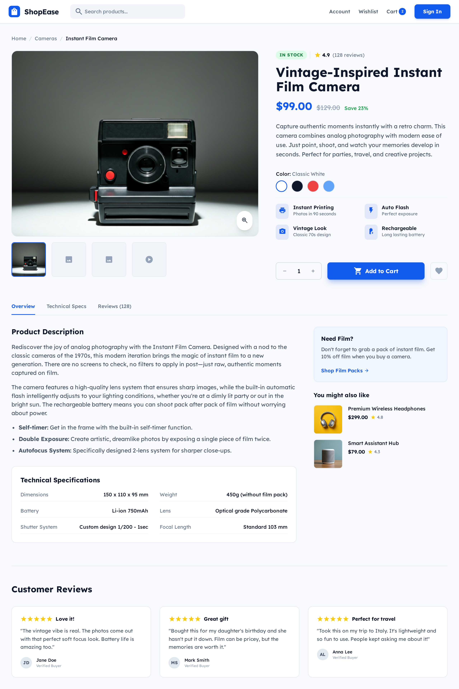
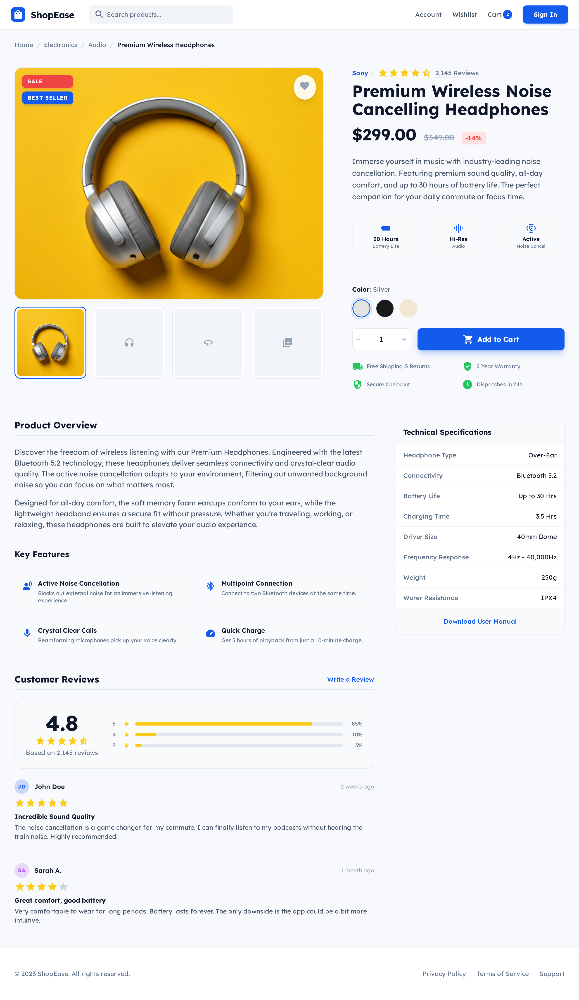
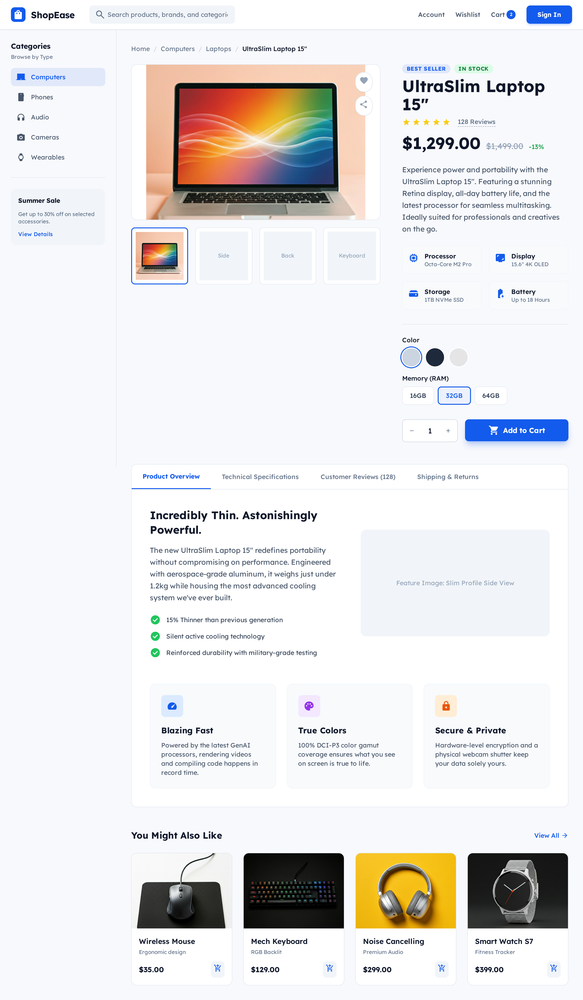

# 🛒 ShopEase — Modern E-Commerce Frontend (HTML + Tailwind CSS)

ShopEase is a **modern, responsive, multi-page e-commerce frontend project** built using **HTML5** and **Tailwind CSS**.
The project simulates a real-world online shopping platform with product listings, detailed product pages, category navigation, and an online course section — all designed with clean UI/UX principles and dark-mode support.

This project focuses purely on **frontend architecture, UI consistency, and responsiveness**, making it ideal for showcasing frontend design and layout skills.

---

## 🚀 Features

* ✅ Fully responsive layout (mobile, tablet, desktop)
* 🌙 Light & Dark mode support
* 🧭 Multi-page navigation system
* 🛍️ Product catalog with filters and categories
* 📦 Individual product detail pages
* 🎓 Online course platform page
* 🔍 Search bar UI (visual implementation)
* 💄 Modern UI with consistent spacing & typography
* ⚡ Built using Tailwind CSS CDN (no build tools required)

---

## 📂 Pages Included

| Page                      | Description                                                  |
| ------------------------- | ------------------------------------------------------------ |
| `index.html`              | Main electronics catalog with sidebar filters and categories |
| `Online_course_page.html` | Dedicated online course landing page                         |
| `page2.html`              | Smart Assistant product details                              |
| `page3.html`              | Fitness band product page                                    |
| `page4.html`              | Electronics catalog variation                                |
| `page5.html`              | Ergonomic mouse product page                                 |
| `page6.html`              | Mechanical keyboard product page                             |
| `page7.html`              | Smart watch product page                                     |
| `page8.html`              | Instant film camera product page                             |
| `page9.html`              | Premium wireless headphones product page                     |

All pages maintain **consistent headers, navigation, typography, and design language**, which is critical in real production systems

---

## 🧑‍💻 Tech Stack

* **HTML5**
* **Tailwind CSS (CDN)**
* **Google Fonts (Lexend, Noto Sans)**
* **Material Symbols Icons**

No JavaScript frameworks, no bundlers, no backend — pure frontend UI engineering.

---

## 🛠️ How to Run Locally

1. Clone the repository:

   ```bash
   git clone https://github.com/your-username/shopease.git
   ```
2. Navigate into the project folder:

   ```bash
   cd shopease
   ```
3. Open `index.html` in your browser
   *(or use Live Server in VS Code for best experience)*

That’s it. No installs. No configs. Zero excuses.

---

## 📸 Screenshots

### 🏠 Electronics Catalog


### 🎓 Online Course Platform


### 🏠 Smart Assistant Hub


### ⌚ FitTrack Pro Band


### 🖱️ Ergonomic Wireless Mouse


### ⌨️ RGB Mechanical Keyboard


### ⌚ Series 7 Smart Watch


### 📷 Instant Film Camera


### 🎧 Premium Wireless Headphones


### 💻 UltraSlim Laptop 15"


### 🛒 Electronics Catalog (Additional View)


